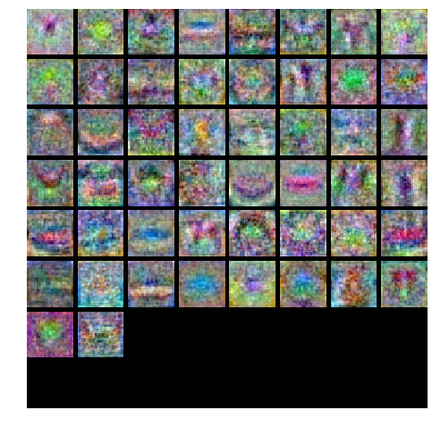

# TwoLayerNet
---
[题目](http://cs231n.github.io/assignments2016/assignment1/)

[我的代码](https://github.com/rao1219/TwoLayerNet)

---
# 包结构
+ TwoLayerNet
    + cs231n
        + classifiers
            + neural_net.py: 我的网络 
        + datasets： cifar-10-batches-py
    + setup.py: 网络初始化
    + testnet.py: 前向和反向传播参数计算
    + train.py: 训练过程
    + tune.py: 调试参数
    + test.py: 在测试集上检验准确率
     
---
# 我的网络


两层全连接网络
+ 输入层N维，隐含层H维，输出C类
+ loss function: softmax
+ 结构：
    +  **input - fully connected layer - ReLU - fully connected layer - softmax**
+ output: 每个class的得分

---

# 训练过程
### 0. setup

```python
# A bit of setup

import numpy as np
import matplotlib.pyplot as plt

from cs231n.classifiers.neural_net import TwoLayerNet
# Create a small net and some toy data to check your implementations.
# Note that we set the random seed for repeatable experiments.

input_size = 4
hidden_size = 10
num_classes = 3
num_inputs = 5

def init_toy_model():
  np.random.seed(0)
  return TwoLayerNet(input_size, hidden_size, num_classes, std=1e-1)

def init_toy_data():
  np.random.seed(1)
  X = 10 * np.random.randn(num_inputs, input_size)
  y = np.array([0, 1, 2, 2, 1])
  return X, y

net = init_toy_model()
X, y = init_toy_data()
```

+ testnet.py
### 1. Forward pass: 
+ #### **process**
```python

layer1 = X.dot(W1)+b1
layer2 = relu(layer1)
layer3 = layer2.dot(W2) + b2
    
scores = layer3
```
+ ####  **compute scores:**

```python
scores = net.loss(X)
print 'Your scores:'
print scores
print
print 'correct scores:'
correct_scores = np.asarray([
  [-0.81233741, -1.27654624, -0.70335995],
  [-0.17129677, -1.18803311, -0.47310444],
  [-0.51590475, -1.01354314, -0.8504215 ],
  [-0.15419291, -0.48629638, -0.52901952],
  [-0.00618733, -0.12435261, -0.15226949]])
print correct_scores
print

# The difference should be very small. We get < 1e-7
print 'Difference between your scores and correct scores:'
print np.sum(np.abs(scores - correct_scores))
```
输出结果：
```
Your scores:
[[-0.81233741 -1.27654624 -0.70335995]
 [-0.17129677 -1.18803311 -0.47310444]
 [-0.51590475 -1.01354314 -0.8504215 ]
 [-0.15419291 -0.48629638 -0.52901952]
 [-0.00618733 -0.12435261 -0.15226949]]

correct scores:
[[-0.81233741 -1.27654624 -0.70335995]
 [-0.17129677 -1.18803311 -0.47310444]
 [-0.51590475 -1.01354314 -0.8504215 ]
 [-0.15419291 -0.48629638 -0.52901952]
 [-0.00618733 -0.12435261 -0.15226949]]

Difference between your scores and correct scores:
3.68027207103e-08
```


+ #### **compute loss:**

评估：
```python
loss, _ = net.loss(X, y, reg=0.1)
correct_loss = 1.30378789133

# should be very small, we get < 1e-12
print 'Difference between your loss and correct loss:'
print np.sum(np.abs(loss - correct_loss))
```
输出结果:

```
Difference between your loss and correct loss:
1.79412040779e-13
```

### 2. Backward pass
过程：
```python
dlayer4 = 1.0

dlayer3 = (np.exp(layer3).T / rows).T
ys = np.zeros(dlayer3.shape)
ys[range(N),y] = 1
dlayer3 -= ys

dlayer3 /=N
dlayer3 *= dlayer4

dlayer2 = dlayer3.dot(W2.T)

dlayer1 = dlayer2 * (layer1>=0)

dlayer2 = dlayer3.dot(W2.T)

dW1 = X.T.dot(dlayer1)
dW2 = layer2.T.dot(dlayer3)

db1 = np.sum(dlayer1, axis = 0)
db2 = np.sum(dlayer3, axis = 0)

dW1 += reg * W1
dW2 += reg * W2

grads['W1'] = dW1
grads['W2'] = dW2
grads['b1'] = db1
grads['b2'] = db2

```

评估:
```python
from cs231n.gradient_check import eval_numerical_gradient

# Use numeric gradient checking to check your implementation of the backward pass.
# If your implementation is correct, the difference between the numeric and
# analytic gradients should be less than 1e-8 for each of W1, W2, b1, and b2.

loss, grads = net.loss(X, y, reg=0.1)
# these should all be less than 1e-8 or so
for param_name in grads:
    f = lambda W: net.loss(X, y, reg=0.1)[0]
    param_grad_num = eval_numerical_gradient(f, net.params[param_name], verbose=False)
    print(grads[param_name])
    print(param_grad_num)
    print('%s max relative error: %e' % (param_name, rel_error(param_grad_num, grads[param_name])))
```
```
[[ -9.68499043e-02   4.00157208e-03  -2.05517828e-01   1.87986352e-01
    1.60531645e-01  -9.77277880e-03   9.50088418e-03   2.68884345e-03
   -3.01022811e-02  -5.67802801e-03]
 [  4.45595008e-02   1.45427351e-02   6.95515502e-01  -2.88616327e-01
   -2.66986989e-01   3.33674327e-03   1.49407907e-02   1.93435586e-02
   -6.54700997e-02  -5.32928651e-01]
 [  1.16977821e-02   6.53618595e-03  -2.31623550e-01  -6.26390355e-02
   -1.41638971e-03  -1.45436567e-02   4.57585173e-04  -2.90067077e-03
    5.35668029e-01   3.69731998e-01]
 [  7.71766403e-02   3.78162520e-03  -3.13778323e-01   2.26868568e-01
    2.06678709e-01   1.56348969e-03   1.23029068e-02  -2.18055786e-03
   -6.78943040e-01   9.85573015e-02]]
[[ -9.68499043e-02   4.00157207e-03  -2.05517828e-01   1.87986352e-01
    1.60531645e-01  -9.77277881e-03   9.50088417e-03   2.68884345e-03
   -3.01022811e-02  -5.67802800e-03]
 [  4.45595008e-02   1.45427351e-02   6.95515502e-01  -2.88616327e-01
   -2.66986989e-01   3.33674328e-03   1.49407907e-02   1.93435586e-02
   -6.54700997e-02  -5.32928651e-01]
 [  1.16977821e-02   6.53618595e-03  -2.31623550e-01  -6.26390356e-02
   -1.41638971e-03  -1.45436567e-02   4.57585170e-04  -2.90067078e-03
    5.35668029e-01   3.69731998e-01]
 [  7.71766403e-02   3.78162519e-03  -3.13778323e-01   2.26868568e-01
    2.06678709e-01   1.56348969e-03   1.23029068e-02  -2.18055787e-03
   -6.78943040e-01   9.85573015e-02]]
W1 max relative error: 3.561318e-09
[[ -5.13764691e-01   1.67232930e-01   3.04783350e-01]
 [  1.95077540e-02  -5.09652182e-03  -4.38074302e-03]
 [  2.92229174e-01   1.18896894e-01  -4.32018096e-01]
 [ -2.33121075e-01   1.86288200e-01   3.96198312e-02]
 [  7.78174796e-01  -3.54233027e-01  -4.41137965e-01]
 [  4.28331871e-03   6.65172224e-04   3.02471898e-03]
 [ -6.34322094e-03  -3.62741166e-03  -6.72460448e-03]
 [  6.17281609e-02  -1.29900489e-01   3.91825079e-02]
 [  6.32053946e-01  -8.44023525e-02  -5.66197124e-01]
 [  8.89334995e-01  -6.04709349e-01  -2.88551353e-01]]
[[ -5.13764691e-01   1.67232930e-01   3.04783350e-01]
 [  1.95077539e-02  -5.09652183e-03  -4.38074301e-03]
 [  2.92229174e-01   1.18896894e-01  -4.32018096e-01]
 [ -2.33121075e-01   1.86288200e-01   3.96198312e-02]
 [  7.78174796e-01  -3.54233027e-01  -4.41137965e-01]
 [  4.28331870e-03   6.65172228e-04   3.02471899e-03]
 [ -6.34322094e-03  -3.62741166e-03  -6.72460447e-03]
 [  6.17281609e-02  -1.29900489e-01   3.91825079e-02]
 [  6.32053946e-01  -8.44023525e-02  -5.66197124e-01]
 [  8.89334995e-01  -6.04709348e-01  -2.88551353e-01]]
W2 max relative error: 3.440708e-09
[ 0.2099691 -0.1431905 -0.0667786]
[ 0.2099691 -0.1431905 -0.0667786]
b2 max relative error: 4.447646e-11
[-0.0070484   0.          0.00310494 -0.0072399  -0.00573377  0.          0.
 -0.0024372   0.04121605  0.02236176]
[-0.0070484   0.          0.00310494 -0.0072399  -0.00573377  0.          0.
 -0.0024372   0.04121605  0.02236176]
b1 max relative error: 2.999857e-09
```
### 3. Train the network
```python
def train(self, X, y, X_val, y_val,
            learning_rate=1e-3, learning_rate_decay=0.95,
            reg=1e-5, num_iters=100,
            batch_size=200, verbose=False):
    """
    Train this neural network using stochastic gradient descent.
    Inputs:
    - X: A numpy array of shape (N, D) giving training data.
    - y: A numpy array f shape (N,) giving training labels; y[i] = c means that
      X[i] has label c, where 0 <= c < C.
    - X_val: A numpy array of shape (N_val, D) giving validation data.
    - y_val: A numpy array of shape (N_val,) giving validation labels.
    - learning_rate: Scalar giving learning rate for optimization.
    - learning_rate_decay: Scalar giving factor used to decay the learning rate
      after each epoch.
    - reg: Scalar giving regularization strength.
    - num_iters: Number of steps to take when optimizing.
    - batch_size: Number of training examples to use per step.
    - verbose: boolean; if true print progress during optimization.
    """
    num_train = X.shape[0]
    iterations_per_epoch = max(num_train / batch_size, 1)

    # Use SGD to optimize the parameters in self.model
    loss_history = []
    train_acc_history = []
    val_acc_history = []

    for it in xrange(num_iters):
      X_batch = None
      y_batch = None


      pass
      indices = np.random.choice(num_train,batch_size)
      X_batch = X[indices]
      y_batch = y[indices]


      # Compute loss and gradients using the current minibatch
      loss, grads = self.loss(X_batch, y=y_batch, reg=reg)
      loss_history.append(loss)

      pass
      self.params['W1'] -= grads['W1'] * learning_rate
      self.params['b1'] -= grads['b1'] * learning_rate
      self.params['W2'] -= grads['W2'] * learning_rate
      self.params['b2'] -= grads['b2'] * learning_rate

      if verbose and it % 100 == 0:
        print 'iteration %d / %d: loss %f' % (it, num_iters, loss)

      # Every epoch, check train and val accuracy and decay learning rate.
      if it % iterations_per_epoch == 0:
        # Check accuracy
        train_acc = (self.predict(X_batch) == y_batch).mean()
        val_acc = (self.predict(X_val) == y_val).mean()
        train_acc_history.append(train_acc)
        val_acc_history.append(val_acc)

        # Decay learning rate
        learning_rate *= learning_rate_decay

    return {
      'loss_history': loss_history,
      'train_acc_history': train_acc_history,
      'val_acc_history': val_acc_history,
    }

```
```python
net = init_toy_model()
stats = net.train(X, y, X, y,
            learning_rate=1e-1, reg=1e-5,
            num_iters=100, verbose=False)

print 'Final training loss: ', stats['loss_history'][-1]

# plot the loss history
plt.plot(stats['loss_history'])
plt.xlabel('iteration')
plt.ylabel('training loss')
plt.title('Training Loss history')
plt.show()

```
training loss:  0.0171496079387


### 4. Load data
```python
from cs231n.data_utils import load_CIFAR10

def get_CIFAR10_data(num_training=49000, num_validation=1000, num_test=1000):
    """
    Load the CIFAR-10 dataset from disk and perform preprocessing to prepare
    it for the two-layer neural net classifier. These are the same steps as
    we used for the SVM, but condensed to a single function.  
    """
    # Load the raw CIFAR-10 data
    cifar10_dir = 'cs231n/datasets/cifar-10-batches-py'
    X_train, y_train, X_test, y_test = load_CIFAR10(cifar10_dir)
        
    # Subsample the data
    mask = range(num_training, num_training + num_validation)
    X_val = X_train[mask]
    y_val = y_train[mask]
    mask = range(num_training)
    X_train = X_train[mask]
    y_train = y_train[mask]
    mask = range(num_test)
    X_test = X_test[mask]
    y_test = y_test[mask]

    # Normalize the data: subtract the mean image
    mean_image = np.mean(X_train, axis=0)
    X_train -= mean_image
    X_val -= mean_image
    X_test -= mean_image

    # Reshape data to rows
    X_train = X_train.reshape(num_training, -1)
    X_val = X_val.reshape(num_validation, -1)
    X_test = X_test.reshape(num_test, -1)

    return X_train, y_train, X_val, y_val, X_test, y_test


# Invoke the above function to get our data.
X_train, y_train, X_val, y_val, X_test, y_test = get_CIFAR10_data()
print 'Train data shape: ', X_train.shape
print 'Train labels shape: ', y_train.shape
print 'Validation data shape: ', X_val.shape
print 'Validation labels shape: ', y_val.shape
print 'Test data shape: ', X_test.shape
print 'Test labels shape: ', y_test.shape
```

```
Train data shape:  (49000, 3072)
Train labels shape:  (49000,)
Validation data shape:  (1000, 3072)
Validation labels shape:  (1000,)
Test data shape:  (1000, 3072)
Test labels shape:  (1000,)
```

### 5. Train a network
```python
input_size = 32 * 32 * 3
hidden_size = 50
num_classes = 10
net = TwoLayerNet(input_size, hidden_size, num_classes)

# Train the network
stats = net.train(X_train, y_train, X_val, y_val,
            num_iters=1000, batch_size=200,
            learning_rate=1e-4, learning_rate_decay=0.95,
            reg=0.5, verbose=True)

# Predict on the validation set
val_acc = (net.predict(X_val) == y_val).mean()
print 'Validation accuracy: ', val_acc

```
结果：
```
iteration 0 / 1000: loss 2.302954
iteration 100 / 1000: loss 2.302550
iteration 200 / 1000: loss 2.297648
iteration 300 / 1000: loss 2.259602
iteration 400 / 1000: loss 2.204170
iteration 500 / 1000: loss 2.118565
iteration 600 / 1000: loss 2.051535
iteration 700 / 1000: loss 1.988466
iteration 800 / 1000: loss 2.006591
iteration 900 / 1000: loss 1.951473
Validation accuracy:  0.287
```

### 6. Debug the training 
```python
# Plot the loss function and train / validation accuracies
plt.subplot(2, 1, 1)
plt.plot(stats['loss_history'])
plt.title('Loss history')
plt.xlabel('Iteration')
plt.ylabel('Loss')

plt.subplot(2, 1, 2)
plt.plot(stats['train_acc_history'], label='train')
plt.plot(stats['val_acc_history'], label='val')
plt.title('Classification accuracy history')
plt.xlabel('Epoch')
plt.ylabel('Clasification accuracy')
plt.show()
```


```python
from cs231n.vis_utils import visualize_grid

# Visualize the weights of the network

def show_net_weights(net):
  W1 = net.params['W1']
  W1 = W1.reshape(32, 32, 3, -1).transpose(3, 0, 1, 2)
  plt.imshow(visualize_grid(W1, padding=3).astype('uint8'))
  plt.gca().axis('off')
  plt.show()

show_net_weights(net)
```

### 7. Tune the hyperparameters
```python
best_net = None # store the best model into this 
best_acc = 0

input_size = 32 * 32 * 3
hidden_size = 50
num_classes = 10

learning_rates = np.logspace(-3.5,-2.5,10)
regularization_rates = np.logspace(-2,0,5)
for learning_rate in learning_rates:
    for regularization_rate in regularization_rates:
        net = TwoLayerNet(input_size, hidden_size, num_classes)
        print("Regularization : " + str(regularization_rate) + " Learning : " + str(learning_rate))
        # Train the network
        stats = net.train(X_train, y_train, X_val, y_val,
                    num_iters=2000, batch_size=200,
                    learning_rate=learning_rate, learning_rate_decay=0.95,
                    reg=regularization_rate, verbose=False)

        # Predict on the validation set
        val_acc = (net.predict(X_val) == y_val).mean()
        print("Acc : " + str(val_acc))
        if val_acc > best_acc:
            best_net = net
            best_acc = val_acc

```
输出：
```
Regularization : 0.01 Learning : 0.000316227766017
Acc : 0.466
Regularization : 0.0316227766017 Learning : 0.000316227766017
Acc : 0.457
Regularization : 0.1 Learning : 0.000316227766017
Acc : 0.46
Regularization : 0.316227766017 Learning : 0.000316227766017
Acc : 0.467
Regularization : 1.0 Learning : 0.000316227766017
Acc : 0.464
Regularization : 0.01 Learning : 0.000408423865267
Acc : 0.475
Regularization : 0.0316227766017 Learning : 0.000408423865267
Acc : 0.463
Regularization : 0.1 Learning : 0.000408423865267
Acc : 0.465
Regularization : 0.316227766017 Learning : 0.000408423865267
Acc : 0.476
Regularization : 1.0 Learning : 0.000408423865267
Acc : 0.462
Regularization : 0.01 Learning : 0.00052749970637
Acc : 0.467
Regularization : 0.0316227766017 Learning : 0.00052749970637
Acc : 0.471
Regularization : 0.1 Learning : 0.00052749970637
Acc : 0.486
Regularization : 0.316227766017 Learning : 0.00052749970637
Acc : 0.471
Regularization : 1.0 Learning : 0.00052749970637
Acc : 0.474
Regularization : 0.01 Learning : 0.000681292069058
Acc : 0.5
Regularization : 0.0316227766017 Learning : 0.000681292069058
Acc : 0.467
Regularization : 0.1 Learning : 0.000681292069058
Acc : 0.487
Regularization : 0.316227766017 Learning : 0.000681292069058
Acc : 0.49
Regularization : 1.0 Learning : 0.000681292069058
Acc : 0.489
Regularization : 0.01 Learning : 0.000879922543569
Acc : 0.489
Regularization : 0.0316227766017 Learning : 0.000879922543569
Acc : 0.497
Regularization : 0.1 Learning : 0.000879922543569
Acc : 0.492
Regularization : 0.316227766017 Learning : 0.000879922543569
Acc : 0.492
Regularization : 1.0 Learning : 0.000879922543569
Acc : 0.487
Regularization : 0.01 Learning : 0.00113646366639
Acc : 0.497
Regularization : 0.0316227766017 Learning : 0.00113646366639
Acc : 0.504
Regularization : 0.1 Learning : 0.00113646366639
Acc : 0.494
Regularization : 0.316227766017 Learning : 0.00113646366639
Acc : 0.501
Regularization : 1.0 Learning : 0.00113646366639
Acc : 0.479
Regularization : 0.01 Learning : 0.00146779926762
Acc : 0.498
Regularization : 0.0316227766017 Learning : 0.00146779926762
Acc : 0.504
Regularization : 0.1 Learning : 0.00146779926762
Acc : 0.508
Regularization : 0.316227766017 Learning : 0.00146779926762
Acc : 0.498
Regularization : 1.0 Learning : 0.00146779926762
Acc : 0.492
Regularization : 0.01 Learning : 0.00189573565241
Acc : 0.487
Regularization : 0.0316227766017 Learning : 0.00189573565241
Acc : 0.506
Regularization : 0.1 Learning : 0.00189573565241
Acc : 0.491
Regularization : 0.316227766017 Learning : 0.00189573565241
Acc : 0.497
Regularization : 1.0 Learning : 0.00189573565241
Acc : 0.508
Regularization : 0.01 Learning : 0.00244843674682
Acc : 0.504
Regularization : 0.0316227766017 Learning : 0.00244843674682
Acc : 0.494
Regularization : 0.1 Learning : 0.00244843674682
Acc : 0.485
Regularization : 0.316227766017 Learning : 0.00244843674682
Acc : 0.479
Regularization : 1.0 Learning : 0.00244843674682
Acc : 0.433
Regularization : 0.01 Learning : 0.00316227766017
Acc : 0.483
Regularization : 0.0316227766017 Learning : 0.00316227766017
Acc : 0.435
Regularization : 0.1 Learning : 0.00316227766017
Acc : 0.463
Regularization : 0.316227766017 Learning : 0.00316227766017
Acc : 0.484
Regularization : 1.0 Learning : 0.00316227766017
Acc : 0.449
```

```
# visualize the weights of the best network
show_net_weights(best_net)
```


### 8. Run on the test set
```python
test_acc = (best_net.predict(X_test) == y_test).mean()
print 'Test accuracy: ', test_acc
```
Test accuracy:  0.499


